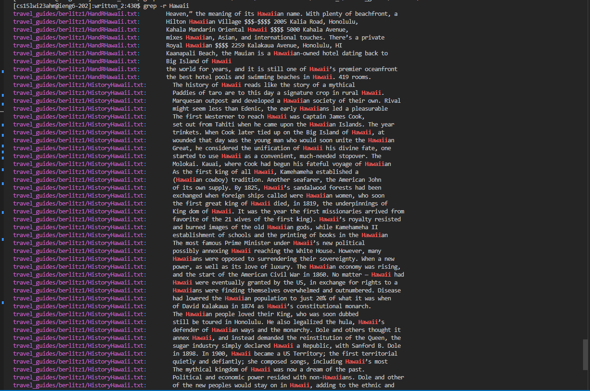

#Lab Report 3 Researching commands
##grep

```
$ grep -options searchword /filepath
```

###using grep without any options

```
$ grep Hawaii ~/newdir/skill-demo1-data/written_2/travel_guides/berlitz1/HandRHawaii.txt
```


-using this command should display all the instances of the "Hawaii" in the specified filepath
###grep with no found pattern
```
$ grep WordNotInSearch  ~/newdir/skill-demo1-data/written_2/travel_guides/berlitz1/HandRHawaii.txt
```

-using this command with no pattern matched will result in nothing happening
```
$ grep -n Hawaii ~/newdir/skill-demo1-data/written_2/travel_guides/berlitz1/HandRHawaii.txt
```

-using grep with the -n option will show line numbers for search results
```
$ grep -w 
```

- using grep with w will only match "words" so words like Hawaiian will not be output
```
$ grep -r Hawaii
```

- using the -r option allowes us to recursively search through a directory recursively in this command we are searching through written_2


