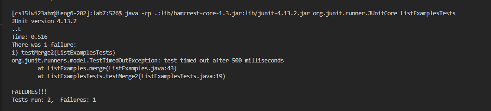
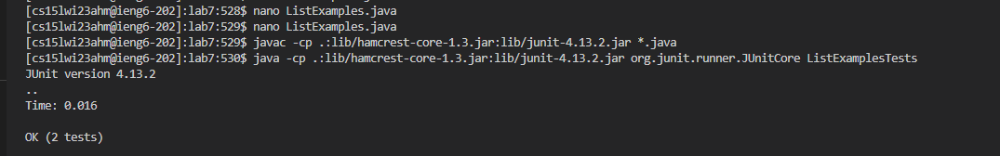
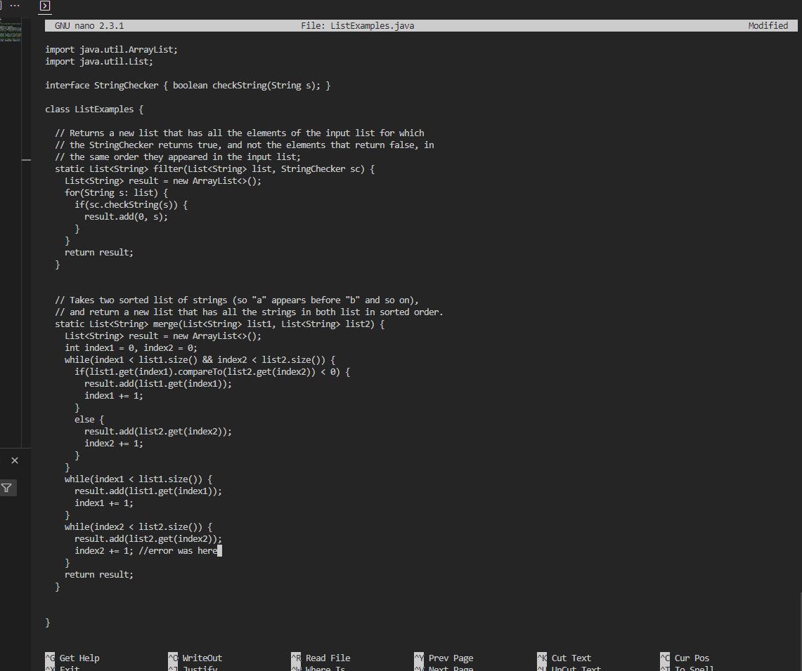
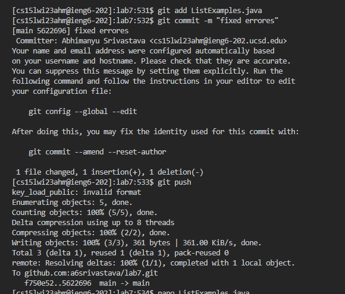

# Lab Report 4
## Task 4 - 9
- 
```
$ git clone git@github.com:a6srivastava/lab7.git <enter>
$ ls 
$ cd lab7/
$ ls
```
- 
```
$ javac -cp .:lib/hamcrest-core-1.3.jar:lib/junit-4.13.2.jar *.java <enter>
$ java -cp .:lib/hamcrest-core-1.3.jar:lib/junit-4.13.2.jar org.junit.runner.JUnitCore ListExamplesTests <enter>
```
- 
```
$ nano ListExamples.java <enter>
$ edited the line shown in the image below 
$ <ctrl+O><ctrl+X>
$ <up><up><enter>
```
- 
- 
```
$ git add ListExamples.java
$ git commit -m "fixed errores"
```
