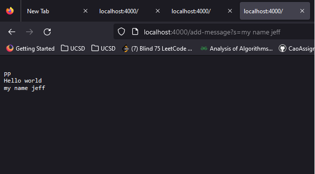
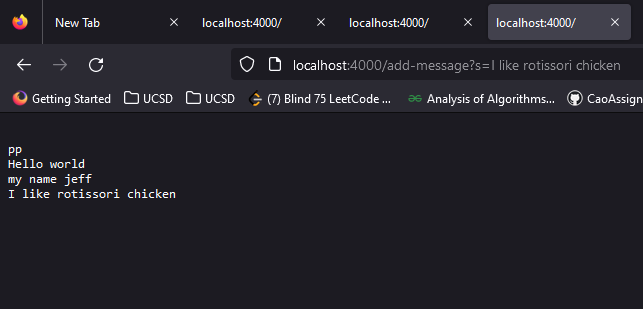

# Cse_15L Lab Report 2 - Servers and Bugs (Week 3)
## Part 1 StringServer
### StringServer.java
```
import java.io.IOException;
import java.net.URI;
import java.util.Arrays;

class Handler implements URLHandler {
    // The one bit of state on the server: a number that will be manipulated by
    // various requests.
    int num = 0;
    String[] stringarray = new String[100];
    String temp = new String("");
    public String handleRequest(URI url) {
            
            System.out.println("Path: " + url.getPath());
            if (url.getPath().contains("/add-message")) {
                String[] parameters = url.getQuery().split("=");
                if (parameters[0].equals("s")) {
                    temp =  parameters[1];
                    stringarray[num]=temp;
                    num++;
                    
                }
                String j = "";
                for(int i=0;stringarray[i]!=null;i++){
                    j = j + "\n" + stringarray[i];
                    
                }
                
                return String.format("%s", j);
                
            }
            
            return "404 Not Found!";
        }
    
}
public class StringServer {
    public static void main(String[] args) throws IOException {
        if(args.length == 0){
            System.out.println("Missing port number! Try any number between 1024 to 49151");
            return;
        }

        int port = Integer.parseInt(args[0]);

        Server.start(port, new Handler());
    }
}
```
  

 
- The code essentially checks for the parameter "/add-message" and the query behind it, the array within the class stores all the previous queries typed. The page will also display all messages so far by printing the full contents of the array.
- the array called stringarray is a String[] that holds the previous queries and gets updated every request.
## Part 2
```
@Test 
public void testReverseInPlace() {
    int[] input1 = { 1,2,3,4,5 };
    ArrayExamples.reverseInPlace(input1);
    assertArrayEquals(new int[]{ 5,4,3,2,1 }, input1);
    int[] input2 = { 1,2,3,2,1 };
    ArrayExamples.reverseInPlace(input1);
    assertArrayEquals(new int[]{ 1,2,3,2,1 }, input2);
}
```
- Above shown is a faliure inducing test followed by a non faliure inducing input
- the first input fails due to the list copying onto itself hence changing to the wrong elements
- the second input wont fail because the second half of the array is aldready the same as the first half.
### faulty code
```
static void reverseInPlace(int[] arr) {
    for(int i = 0; i < arr.length; i += 1) {
      arr[i] = arr[arr.length - i - 1];
    }
  }
```
### fixed code
```
static void reverseInPlace(int[] arr) {
    int[] tmp = [arr.length];
    tmp = arr.clone();
    for(int i = 0; i < arr.length; i += 1) {
      arr[i] = tmp[arr.length - i - 1];
    }
  }
```
- the fix created a temporary array and copies over the values so that the values int the arr itself doesnt get overwritten
## Part 3 
- I learned how to write a webserver and test it on my local machine using java files and a library called URI
- I learned to use Junit testing assertions
- What is code correctness, consider all cases, mostly working isnt "working"
