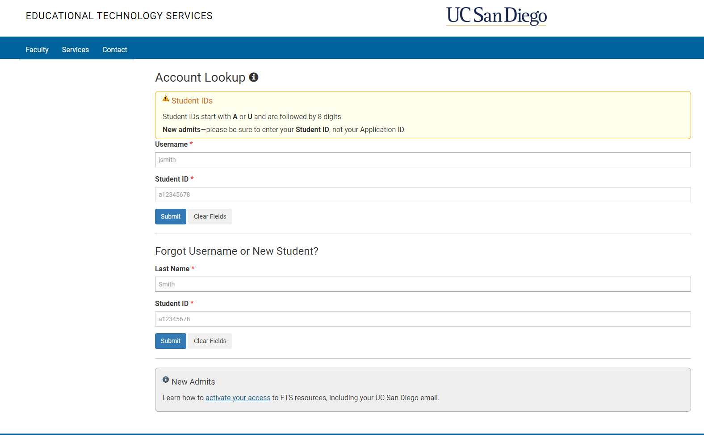
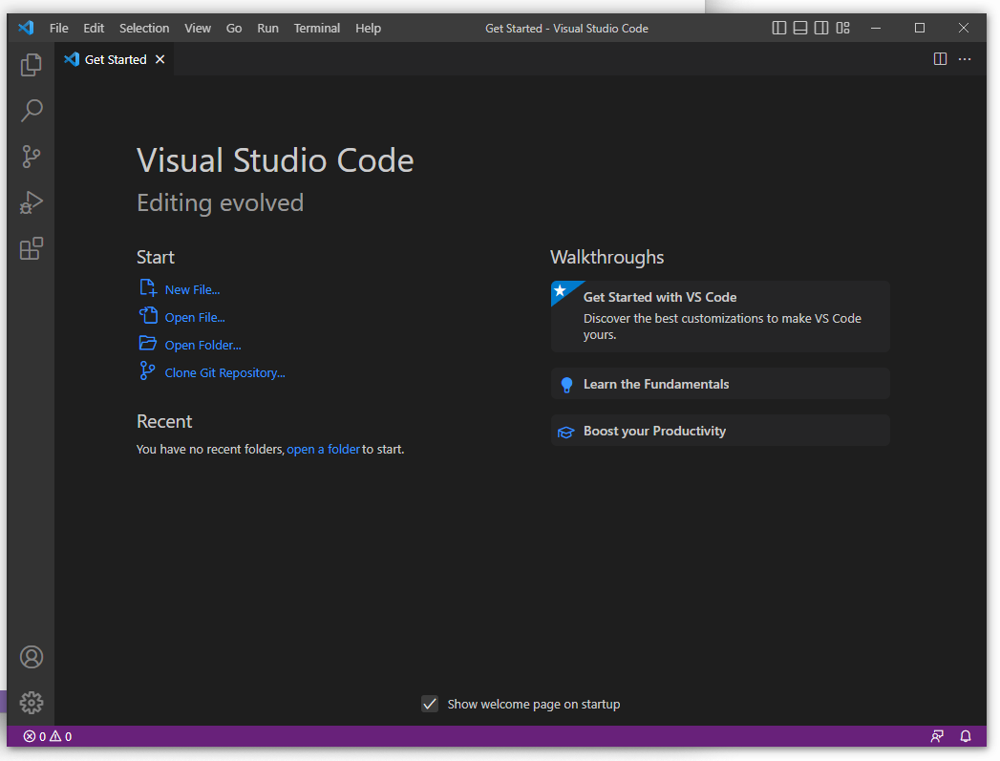
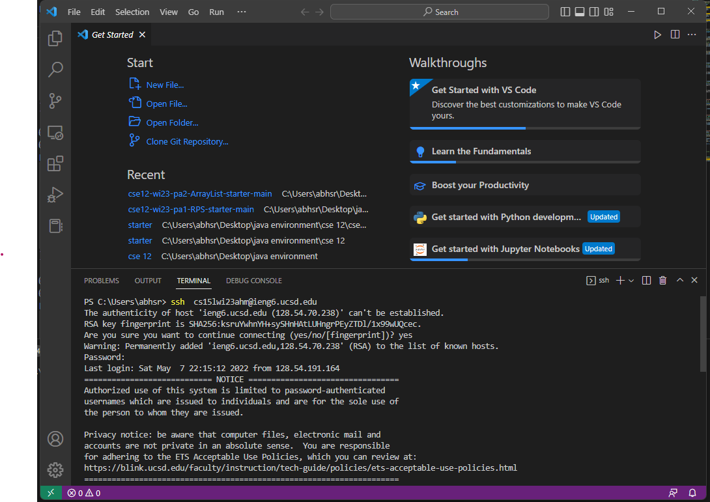
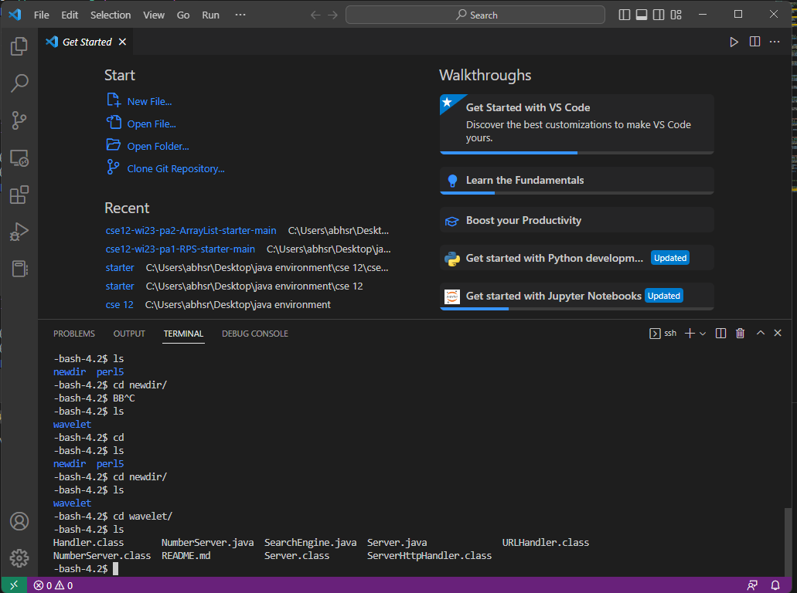

# Lab 1 Tutorial Cse 15L
## Part 1 CSE 15L Account
All students will have access to a specific CSE 15L account. Click [here](https://sdacs.ucsd.edu/~icc/index.php) to change/create your password. Username will be the first part of UCSD email and the ID is your student ID with the first letter NOT in CAPS. Image below
-  
## Part 2 Installing Visual Studio Code
- VS Code [download](https://code.visualstudio.com/)
- Once VS Code has finished installing you should see a screen similar to the one below (Operating systems have different looks).
-  
## Part 3 Remotely Connecting
- To remotely Connect you first have to install Git using this [Link](https://gitforwindows.org/) 
- [git_download](https://gitforwindows.org/)
- [how to use bash](https://stackoverflow.com/questions/42606837/how-do-i-use-bash-on-windows-from-the-visual-studio-code-integrated-terminal/50527994#50527994)
- Once these steps are completed you can go ahead and type in 
- 
- $ ssh cs15lwi23zz@ieng6.ucsd.edu replacing the zz with your unique class id
- You should now type in your password. The cursor wont move just go ahead and type the password
- Once this is finished you should recieve a yes/no prompt to which you should type yes
- you should be connected once these steps are completed.
## Running some commands
Here are some specific useful commands to try:
- ```cd ```
- ```cd```
- ```ls -lat```
- ```ls -a```
- ```ls <directory> where <directory> is /home/linux/ieng6/cs15lwi23/cs15lwi23abc, where the abc is one of the other group members’ username```
- ```cp /home/linux/ieng6/cs15lwi23/public/hello.txt ~/```
- ```cat /home/linux/ieng6/cs15lwi23/public/hello.txt```
- 
- the commands above change directory, list files
- 
    
    
   
    
    
